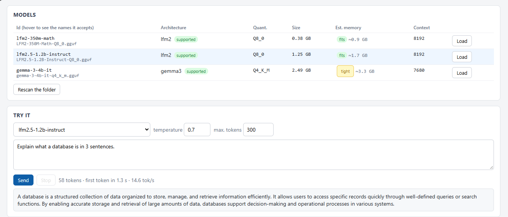
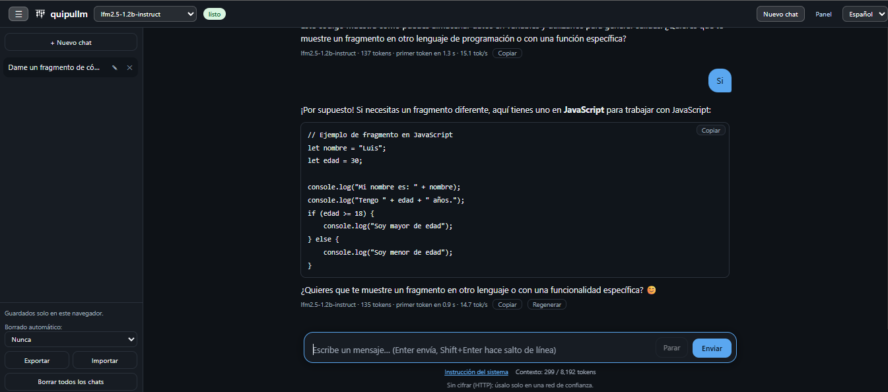

<p align="center"></p>

# quipullm

[English](README.md) · **Español**

Servidor LLM autoalojado con **API compatible con OpenAI y LM Studio**. El motor de inferencia está escrito desde cero en
**WebGPU (WGSL + JavaScript)** y corre dentro de una ventana del navegador; el backend es **Python puro, solo librería estándar**.

**Nada que instalar: sin `pip`, sin `npm`, sin `.exe` ni otros binarios compilados, sin instaladores, sin Docker.** Todo el proyecto es texto plano
(`.py .js .html .json .md`), así que puedes leerlo entero antes de ejecutarlo, y arrancarlo con un comando. Está pensado para PCs donde instalar software es difícil (sin permisos de administrador, equipos bloqueados, sin descargar paquetes):

```
python server.py
```

Lee archivos **GGUF** estándar y sus rutas de texto y de embeddings se comparan número por número con llama.cpp
(ver [Cómo se verifica](#cómo-se-verifica)). Abre <http://localhost:1234/chat> para una página de chat, o apunta cualquier cliente OpenAI a él.





> **Estado: versión temprana (4.1.x).** Medido en tres máquinas: Windows con GPU integrada Intel (comparada con LM Studio),
> Windows con una GTX 1050 Ti y un portátil Linux antiguo con Intel HD 4000 (las dos últimas con solo dos corridas por modelo). AMD, Apple y
> GPU Linux recientes **no están medidas**. Todo lo que sabemos que falta o está flojo está en [docs/LIMITATIONS.md](docs/LIMITATIONS.md).

**No necesitas una tarjeta gráfica dedicada.** Basta una GPU integrada (Intel, AMD o similar) siempre que tu navegador tenga WebGPU con aceleración
por hardware; la máquina con la que comparamos contra LM Studio es justo ese caso. Una tarjeta dedicada no es automáticamente más rápida: una GTX 1050 Ti (Windows, Edge) dio 42 / 14,7 / 5,0 tok/s con esos mismos tres modelos, cerca de esa iGPU (44,3 / 15,7 / 5,3), con solo dos corridas cada uno y sin comparación con LM Studio en esa PC (ver [docs/BENCHMARKS.md](docs/BENCHMARKS.md)).

## ¿Es para ti?

**Encaja bien**

- **Probar modelos locales pequeños (de 1 a 4B aprox.)** para resumir, clasificar, extraer o redactar texto, sin internet y sin costo por token.
- **Pocas personas compartiendo una PC:** arráncalo con `python server.py --share` y envíales el enlace del chat (ver [Compártelo con tu equipo](#compártelo-con-tu-equipo)).
- **Desarrolladores** que quieren una API compatible con OpenAI para probar sin conexión, y un endpoint local de embeddings (`nomic-embed-text`) para prototipos.
- **Quien tenga su propio modelo:** copia cualquier GGUF de una arquitectura soportada a la carpeta de modelos; si tu arquitectura es nueva, agrégala tú
  (a menudo basta un manifiesto JSON) con pruebas de conformidad que la comparan con llama.cpp; ver [Agregar modelos y arquitecturas](#agregar-modelos-y-arquitecturas).
- **Investigadores y estudiantes:** un motor de inferencia WebGPU pequeño y legible, y un [método de validación](#cómo-se-verifica) para estudiar o ampliar.

**No encaja (todavía)**

- **Respuestas rápidas con modelos de 7–8B en una GPU integrada:** unos 2–3 tokens/s en la que medimos.
- **Muchos usuarios a la vez:** atiende una petición a la vez; las demás esperan.
- **Agentes o salida estructurada:** tool calling solo experimental (formato de texto genérico, aún sin medir en modelos reales) y sin JSON schema forzado.
- **Un servidor sin pantalla:** el motor necesita una ventana del navegador abierta en la PC servidora.
- **Lo que exija certificación, auditoría de seguridad externa o tráfico cifrado:** no tiene nada de eso (sin TLS).
  Los prompts se quedan en tu máquina y no encontramos conexiones salientes, pero eso es una comprobación, no una auditoría; revísalo tú.
  Lee [docs/USE_CASES.es.md](docs/USE_CASES.es.md) antes de proponerlo en una organización.

## Inicio rápido (5 pasos, nada que instalar)

1. **Consigue el código.** Descarga el ZIP de este repositorio (o clónalo) y descomprímelo donde quieras.
2. **Comprueba Python 3.** `python --version` debe mostrar 3.x (desarrollado y probado con 3.11). Necesitas también un navegador con WebGPU:
   el probado es **Microsoft Edge** en Windows (abre `edge://gpu` y busca *WebGPU: Hardware accelerated*).
3. **Agrega un modelo.** Pon un archivo `.gguf` de una arquitectura soportada en la carpeta `models/` junto a `server.py`
   (créala). Un modelo pequeño es la mejor primera prueba (ver [qué esperar](#qué-esperar)). Luego puedes elegir otra carpeta en el panel.
4. **Arráncalo.**
   ```
   python server.py
   ```
   Se abre una ventana pequeña llamada *quipullm engine*: **déjala abierta** (puedes minimizarla), ahí se hace el trabajo de la GPU. Abre el
   panel en <http://localhost:1234/>; cuando la insignia diga **motor: listo**, pulsa *Cargar* junto a tu modelo (el panel tiene un selector English/Español arriba a la derecha; por defecto sigue el idioma del navegador).
5. **Habla con él.** Abre la página de chat en <http://localhost:1234/chat>, usa la caja *Probar* del panel, o llámalo desde cualquier cliente OpenAI cambiando solo la URL base:

   ```
   curl http://localhost:1234/v1/chat/completions -H "Content-Type: application/json" \
     -d '{"model":"<id del modelo que muestra el panel>","messages":[{"role":"user","content":"Hola"}],"max_tokens":100}'
   ```
   ```python
   from openai import OpenAI          # pip install openai (en el equipo *cliente*; el servidor no necesita nada)
   c = OpenAI(base_url="http://localhost:1234/v1", api_key="not-needed", timeout=1800)
   print(c.chat.completions.create(model="<id del modelo>", max_tokens=100,
         messages=[{"role": "user", "content": "Hola"}]).choices[0].message.content)
   ```

Por defecto el servidor escucha **solo en este PC** (`127.0.0.1`). Para atender a otros equipos ver [Seguridad](#seguridad).

### Qué esperar

Medido en **un** equipo: Intel Core i7-1270P con GPU integrada Intel UHD, Windows, Edge, una petición a la vez
(tabla completa y método en [docs/BENCHMARKS.md](docs/BENCHMARKS.md)):

| Modelo (cuantización) | Velocidad de generación |
|---|---|
| LFM2 350M math (Q8_0) | 44,3 tok/s |
| LFM2.5 1.2B (Q8_0) | 15,7 tok/s |
| Gemma 3 4B (Q4_K_M) | 5,3 tok/s |
| Qwen2.5-Coder 7B (Q4_K_M) | 2,8–3,1 tok/s |

Tus números serán distintos. Otras dos máquinas (una GTX 1050 Ti en Windows y una Intel HD 4000 en Linux) están en
[docs/BENCHMARKS.md](docs/BENCHMARKS.md), sin comparación con LM Studio. AMD, Apple y GPU NVIDIA/Linux recientes **no están medidas**; si ejecutas
`tools/bench.py`, por favor envíanos los resultados (ver [CONTRIBUTING.md](CONTRIBUTING.md)).

## Características

- Endpoints compatibles con OpenAI: `/v1/chat/completions` (con y sin streaming), `/v1/completions`, `/v1/embeddings`,
  `/v1/models` y `/api/v0/models` de LM Studio. El código existente solo cambia el `base_url` (puerto `1234` por defecto).
- Modelos de razonamiento: `<think>` se devuelve aparte en `reasoning_content`, como LM Studio.
- Visión: imágenes en base64 con `image_url` (LFM2-VL y Gemma 3). Funciona en el equipo probado (tiempos en
  [docs/BENCHMARKS.md](docs/BENCHMARKS.md)); su batería de conformidad coincide con llama.cpp de `llama-cpp-python` 0.3.35 pero
  todavía no con versiones más nuevas, ver [Cómo se verifica](#cómo-se-verifica).
- Embeddings: `nomic-embed-text` (`float` y `base64`).
- Las plantillas de chat se leen del GGUF (`tokenizer.chat_template`) con un intérprete Jinja propio en librería estándar
  (comparado con jinja2 real), con respaldos escritos a mano.
- **Página de chat** (`/chat`): conversación con streaming, historial solo en la página, botón de parar, instrucción de sistema, razonamiento por separado, inglés/español. No se guarda nada en el servidor.
- **Ejemplo para desarrolladores:** [`examples/agent-chat.html`](examples/agent-chat.html) es un agente de chat web de un solo archivo (instrucción de sistema + streaming) hecho solo con la API; ábrelo en un navegador y apúntalo a tu servidor. Cada ajuste está explicado en [docs/SETTINGS.md](docs/SETTINGS.md) (en inglés). estimación de memoria, estado y registros en vivo, caja de prueba rápida y página de configuración (las opciones avanzadas están plegadas).
- Clave de API opcional, límite de cola (HTTP 429) y estimación de memoria por modelo ("cabe / justo / no cabe").
- **Arquitecturas enchufables:** se agrega un manifiesto en `web/arch/` y se re-escanea, sin reiniciar
  ([docs/ARCH_GUIDE.md](docs/ARCH_GUIDE.md)). Qwen 3 se añadió solo con un manifiesto.

## Arquitecturas soportadas

| `general.architecture` | Modelos probados | Notas |
|---|---|---|
| `lfm2` | LFM2 / LFM2.5 (350M–1.6B), LFM2.5-VL | texto, razonamiento, visión |
| `qwen2` | Qwen2.5-Coder 7B, DeepSeek-R1-Distill-Qwen 7B | K-quants |
| `qwen3` | modelos sintéticos vs llama.cpp | solo manifiesto declarativo |
| `llama` | Mistral-Nemo 12B | familia Llama/Mistral |
| `granite` | IBM Granite 3.2 8B | |
| `gemma3` | Gemma 3 4B | ventana deslizante, texto + visión |
| `deepseek2` | DeepSeek-Coder-V2-Lite | MLA + MoE (variantes Lite) |
| `nomic-bert` | nomic-embed-text-v1.5 | embeddings |

Cuantizaciones: F32, F16, BF16, Q8_0 y K-quants Q2_K–Q6_K; IQ4_NL está implementado para los expertos de DeepSeek.

Los modelos reales que corrimos, con su velocidad medida, están en [docs/BENCHMARKS.md](docs/BENCHMARKS.md). Otros modelos de estas arquitecturas
deberían cargar pero **no están probados**; cuéntanos qué funciona y qué no (basta un issue con el nombre del archivo y la cuantización).

## Cómo funciona

```
cliente ──HTTP :1234──► server.py (Python estándar) ──cola──► ventana del motor (pestaña Edge/Chrome, WebGPU)
                          API, plantillas de chat, lector GGUF            kernels WGSL, tokenizador, muestreo
```

Un proceso, un motor, una petición a la vez (las demás esperan en cola). Detalles en [docs/ARCHITECTURE.md](docs/ARCHITECTURE.md).

## Agregar modelos y arquitecturas

- **Un modelo de una arquitectura soportada:** copia el `.gguf` a la carpeta de modelos (un modelo de visión necesita además
  su `mmproj*.gguf` al lado) y pulsa *Volver a escanear la carpeta* en el panel. Los modelos no se distribuyen con este proyecto y conservan su propia licencia.
- **Una arquitectura nueva:** ver [docs/ARCH_GUIDE.md](docs/ARCH_GUIDE.md). Muchas variantes de transformer solo necesitan un
  manifiesto JSON; las realmente nuevas necesitan un módulo JS. En ambos casos hay un kit de pruebas de conformidad contra
  llama.cpp, de modo que las contribuciones (también las escritas por IA) se aceptan con evidencia.

## Cómo se verifica

Artículo con el método y lo que encontró: [docs/validation-article.es.md](docs/validation-article.es.md).

Cada arquitectura se compara con llama.cpp usando modelos sintéticos pequeños (pesos aleatorios) cuantizados por el propio
llama.cpp: los ids de tokens deben ser idénticos, los logits del último token deben coincidir con la referencia F32 decuantizada
(diferencia relativa < `2e-3`) y la generación voraz y todo el camino HTTP deben dar el mismo texto. Los controles negativos
(por ejemplo, desactivar la ventana deslizante) deben hacer fallar las pruebas.

```
python tests/run_all.py                # pruebas de API con motor simulado, solo librería estándar
pip install -r tests/requirements-engine.txt && playwright install chromium   # solo desarrollo
python tests/run_all.py --engine        # motor vs llama.cpp (fija llama-cpp-python 0.3.35, gguf 0.19.0, numpy 2.4.4)
```

Qué hay que saber antes de confiar en esto:

- Las pruebas `--engine` corren el motor real en Chromium sin ventana con **SwiftShader** (WebGPU por software). Prueban la
  exactitud numérica, **no la velocidad**. La velocidad solo se midió en hardware real en el equipo indicado arriba.
- Los modelos sintéticos prueban que la implementación coincide con llama.cpp en modelos pequeños de pesos aleatorios. No
  sustituyen probar un modelo real en tu GPU.
- **La visión depende de la versión de llama.cpp.** Las pruebas de imagen pasan contra el llama.cpp incluido en `llama-cpp-python`
  0.3.35 y fallan contra 0.3.36, porque upstream cambió cómo preprocesa las imágenes (el filtro del redimensionado bilineal, si una
  imagen LFM2 de una sola tesela lleva el token `<|img_thumbnail|>`, y cuándo LFM2 parte la imagen en teselas) y el motor aún sigue el
  comportamiento anterior. Por eso las versiones están fijadas. Detalles y estado: [docs/LIMITATIONS.md](docs/LIMITATIONS.md).

## Solución de problemas

- **El panel dice que el motor está desconectado.** Pulsa *Abrir motor* en el panel (desde el PC servidor) o reinicia `server.py`.
  Solo una ventana de motor trabaja a la vez; la más nueva toma el control.
- **El panel dice «Servidor: conectado» pero el motor se cae y las peticiones dan 503 hasta pulsar F5 en la ventana del motor.**
  Corregido en 4.0.1 (la ventana del motor corta una consulta colgada a los 35 s y el servidor reabre la ventana si hay peticiones esperando).
  En Edge, desactiva además *Configuración → Sistema y rendimiento → Ahorrar recursos con pestañas inactivas*
  o agrega `http://localhost:1234` a la lista de exclusión, para que el navegador no congele la ventana del motor en segundo plano.
- **Linux: la ventana del motor dice «No WebGPU adapter was found».** Usa Chrome o Chromium (Firefox no trae WebGPU por defecto en Linux); el servidor ahora busca `google-chrome`, `chromium` o `brave-browser` en el `PATH`. Revisa `chrome://gpu`. En una GPU Intel antigua (HD 4000) solo funcionó iniciando Chrome con `--enable-unsafe-webgpu --enable-features=Vulkan --ignore-gpu-blocklist` (ejecuta `python3 server.py --no-engine` y abre `http://localhost:1234/engine` tú mismo en ese Chrome). No se probó cuál de esos flags es el necesario. Ver [docs/LIMITATIONS.md](docs/LIMITATIONS.md).
- **La ventana del motor muestra un error de WebGPU.** Abre `edge://gpu` (o `chrome://gpu`) y comprueba que WebGPU esté acelerado
  por hardware; actualiza el controlador de video.
- **El servidor no puede abrir el puerto 1234.** Otro servidor (LM Studio u otra copia de este) lo está usando. Ciérralo o cambia `port` en el panel.
- **Va lento, o el PC se congela al cargar.** La memoria está justa: cierra otros programas. El panel muestra una estimación
  *cabe / justo / no cabe* por modelo; es una estimación, porque WebGPU no informa la VRAM libre.
- **Registros:** el panel (sección *Registro*), `logs/server.log` y la ventana del motor.

## Compártelo con tu equipo

```
python server.py --share
```

Esto escucha en toda la red y, si no pusiste una clave de API, crea una **para esta ejecución** (sale en la consola y en el panel, y no se escribe en
`config.json`). El panel muestra la dirección para dar a tu equipo (por ejemplo `http://192.168.1.20:1234`): quien la abra desde otra PC cae directo en
el chat, escribe la clave una vez y conversa con el modelo. Los desarrolladores usan la misma dirección más `/v1` con `Authorization: Bearer <clave>`.
Ten en cuenta:

- **Las otras PC no ven el panel.** Las envía al chat y no pueden leer el registro, los ajustes ni el historial de peticiones; solo la PC servidora
  administra el servidor. (Pon `"remote_panel": true` en `config.json` si quieres que puedan mirarlo.)
- **Tú eliges qué ofrece el chat.** En la tabla Modelos del panel, marca los modelos que verá tu equipo en el chat y ordénalos con las flechas; el primero
  es el predeterminado. Esto solo da forma a la página de chat: la API sigue listando todos los modelos.
- Usa la **dirección IP**. Los nombres de PC a menudo no se resuelven desde otros sistemas (un portátil Linux normalmente no encuentra una PC Windows por nombre).

- El modelo corre en **tu** GPU, de a una petición: con varias personas, las demás esperan en la cola.
- El tráfico **no va cifrado** (HTTP). Compártelo solo en una red de confianza y nunca por internet.
- Desde otra PC la clave también permite cargar y descargar modelos; sin clave esas acciones se rechazan desde otras PC.
- Para una clave permanente, defínela en el panel (Ajustes → Clave de API) o con `LLM_API_KEY`.

## Seguridad

Por defecto el servidor escucha **solo en 127.0.0.1**. Para abrirlo a tu red usa `--share` (arriba) o pon `"host": "0.0.0.0"` y una clave de API (en el
panel o con la variable `LLM_API_KEY`). Otras páginas web no pueden manejar el panel ni el motor a través de tu navegador
(comprobación de origen y de `Host`). Lee [SECURITY.md](SECURITY.md) antes de exponerlo. No hay TLS; no lo expongas a internet.

## Contribuir

Ver [CONTRIBUTING.md](CONTRIBUTING.md) y el [ROADMAP](ROADMAP.es.md). Donde más ayuda, en orden:

1. **Benchmarks en otro hardware** (AMD, Apple, NVIDIA recientes y Linux, comparaciones con LM Studio) con `tools/bench.py`: medimos tres máquinas, dos de ellas con solo dos corridas por modelo y sin LM Studio.
2. **Probar el arranque del motor en Linux (GPUs recientes) y macOS** (Linux se probó una vez, en una GPU Intel de 2012 con flags especiales de Chrome; macOS sin probar).
3. **Nuevas arquitecturas de modelo** (un manifiesto JSON más una variante del generador de pruebas; ver [docs/ARCH_GUIDE.md](docs/ARCH_GUIDE.md)).
4. **Funciones del roadmap:** medir el tool calling en modelos reales, JSON schema forzado, caché de prompts, modo sin ventana.
5. **Reportes de errores** con el registro del motor, revisión de seguridad, traducciones y renombrado de identificadores.

La interfaz, los mensajes, las claves de configuración y la API HTTP están en inglés; los comentarios y docstrings están en inglés, pero muchos identificadores internos
(nombres de funciones y variables) siguen en español (el proyecto nació en un equipo hispanohablante); traducirlos es bienvenido.

## Licencia y créditos

Apache License 2.0, ver [LICENSE](LICENSE) y [NOTICE](NOTICE). Los archivos de modelos **no** se incluyen y conservan su propia
licencia. El motor es una implementación independiente del formato GGUF y de las arquitecturas de modelos; se valida contra
[llama.cpp](https://github.com/ggml-org/llama.cpp) (MIT) y el paquete `gguf` de Python solo se usa en las pruebas de desarrollo.
Este proyecto no está afiliado a LM Studio, llama.cpp ni a ningún proveedor de modelos.

**Modelos usados en las pruebas y los benchmarks.** No se distribuyen aquí y cada uno conserva su propia licencia y términos (ver su ficha de modelo; revísalos antes de usar un modelo en tu proyecto). Gracias a los equipos que los hicieron:
LFM2 / LFM2.5 / LFM2.5-VL (Liquid AI), Gemma 3 (Google), Qwen2.5-Coder (equipo Qwen, Alibaba Cloud), DeepSeek-R1-Distill-Qwen y DeepSeek-Coder-V2-Lite (DeepSeek), Granite 3.2 (IBM),
Mistral-Nemo-Instruct-2407 (Mistral AI y NVIDIA) y nomic-embed-text-v1.5 (Nomic AI). Los archivos GGUF fueron conversiones de terceros; los nombres de modelos son marcas de sus dueños.
Gracias también a quienes mantienen llama.cpp / ggml y `gguf`, cuya implementación de referencia hizo posible validar número por número, y a LM Studio, usado como referencia de velocidad.

El código se escribió con la ayuda de Claude (Anthropic) como socio técnico; el autor revisa y es responsable de lo que se publica.
